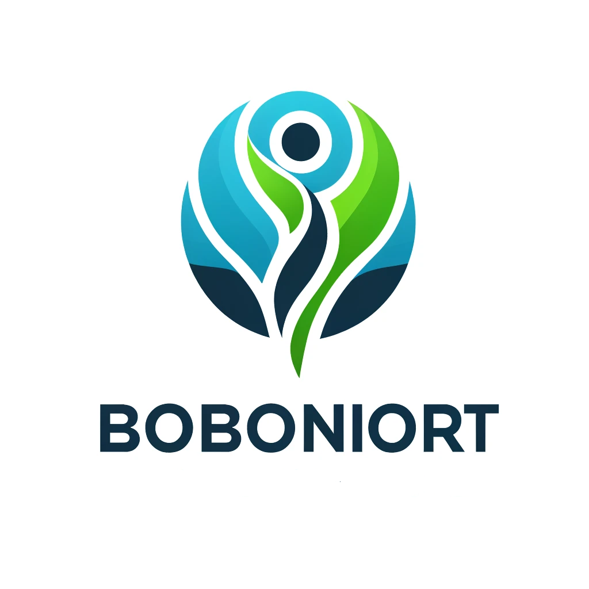

# COBOL-P3-HDF-BOBONIORT&nbsp;&nbsp;&nbsp; 

Voici l'application développée au cours de notre mois de stage en organisation agile.

## Le sujet
Nous avons reçu un courrier de la société **Boboniort** pour développer un écosystème applicatif afin d'améliorer l'efficacité de ses opérations internes.


## La demande était la suivante
- **Développer en COBOL**
- **Fournir une interface conviviale** permettant la saisie et la consultation faciles des informations.
- Les écrans devront avoir des fonctionnalités de **recherche et de filtrage** pour accéder rapidement aux données pertinentes.
- **Automatiser les processus manuels**.

## Les fonctionnalités requises
- **Gestion des adhérents** : enregistrement, modification et archivage des informations personnelles, médicales et administratives des adhérents.
- **Gestion des cotisations** : calcul, facturation et suivi des paiements des cotisations des adhérents.
- **Gestion des remboursements** : enregistrement, traitement et suivi des demandes de remboursement des adhérents.
- **Gestion des prestations** : attribution et suivi des prestations en fonction des garanties souscrites par les adhérents.
- **Génération de rapports** : production de rapports personnalisés pour la direction, les services administratifs et les adhérents.

Notre groupe d'apprenants a répondu à l'appel d'offre.

Vous trouverez ici le cahier des charges fonctionnel, la documentation technique, la documentation utilisateur, le powerpoint de présentation et bien sûr l'application.

N'ayant que **3 semaines** à **8 personnes** pour aboutir à une proposition viable, nous avons découpé le projet en **3 phases** et avons développé la première phase.

## L'application permet donc de
- **Gérer les adhérents**: Recherche d'un adhérent, création d'un adhérent, archivage d'un adhérent.
- **Gérer les prestations**: 3 contrats types sont chargés dans la base, ils sont proposés par défaut, mais l'utilisateur peut personnaliser le contrat. Le coût mensuel du contrat est calculé immédiatement.
- **Gérer les cotisations**: le coût du contrat est calculé au moment de l'affectation. L'utilisateur peut saisir un montant de versement et déclencher une facturation.
- **Gérer les rapports**: une seconde application propose diverses statistiques afin de fournir un premier niveau de rapport. Cette même application charge un fichier CSV fourni par le client afin d'avoir un jeu de données plus important pour la partie client. Le fichier a été chargé dans une table de travail, les données ont été reformatées puis chargées dans la table des adhérents.

Les phases suivantes permettront la modification du contrat, la relance, la gestion des remboursements, d'autres rapports/statistiques à définir avec le client.

## Pour utiliser l'application, récupérez les éléments fournis dans ce GitHub

1. **Créer la base Postgres dans votre environnement.**
   - Nom: `boboniortdb`
   - Utilisateur: `cobol`
   - Mot de passe: `cbl85`

2. **Configurer la base de données:**
   - Ouvrez la fenêtre du terminal dans le répertoire `SQL` et, dans l'ordre, appliquez le script `BoBoniort-full-demo.sql`.
   - Par `\q`, sortez de `psql`, puis exécutez l'exécutable `runvil`. Votre base est prête.

3. **Appropriez-vous les scripts d'exécution:**
   - Pour `scriptMAIN.sh`: 
     ```sh
     sed -i -e 's/\r$//' scriptMAIN.sh
     ```
     Puis lancez le script `./CUSTOMER-MGMT/scriptMAIN.sh` pour voyager dans l'application principale.
   - Pour `script-compile.sh`: 
     ```sh
     sed -i -e 's/\r$//' script-compile.sh
     ```
     Lancez le script `./DATA-MGMT/scriptMAIN.sh` pour accéder à l'application annexe.

     Vous pourrez visualiser les statistiques et charger le fichier CSV (attention, cette dernière fonctionnalité n'est à faire qu'une fois, sinon il y aura des doublons dans la base).

4. **Remise en état de la base:**
   - Retournez dans `psql` depuis une fenêtre de terminal positionnée sur le répertoire `SQL`.
   - Lorsque vous êtes connecté à la base `boboniortdb`, exécutez le script `BoBoTab-DROP.sql` puis `BoBoniort-full-demo.sql`. Enfin, après avoir fermé `psql`, exécutez `runvil`.

Nous espérons que cette application répondra à vos attentes et facilitera vos opérations internes.

